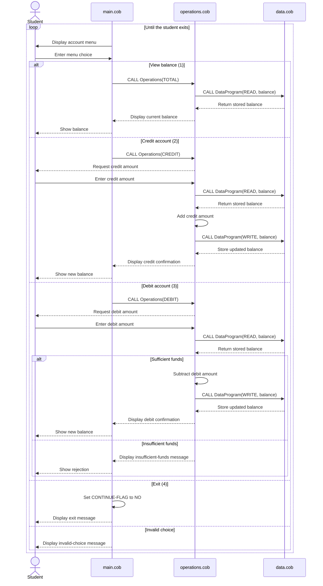

# Student Account COBOL Components

This directory documents the COBOL account-management example in `src/cobol`. The program models a simple student account with a stored balance and interactive credit/debit operations.

## Component Overview

### `main.cob`

`main.cob` is the interactive entry point and menu controller.

Key responsibilities:

- Displays the Account Management System menu.
- Accepts a user choice from 1 through 4.
- Dispatches supported requests to the `Operations` program:
  - `TOTAL ` to view the current balance.
  - `CREDIT` to add funds.
  - `DEBIT ` to remove funds.
- Ends the loop when the user selects option 4.
- Displays an error for any choice outside the supported range.

The program continues showing the menu until its `CONTINUE-FLAG` is changed from `YES` to `NO`.

### `operations.cob`

`operations.cob` contains the account business operations.

Key responsibilities:

- Handles the operation passed by `main.cob`.
- Reads the current balance through `DataProgram` before changing or displaying it.
- Displays the current balance for a `TOTAL ` request.
- Accepts a credit amount, adds it to the balance, and persists the result for a `CREDIT` request.
- Accepts a debit amount, checks available funds, subtracts the amount, and persists the result for a `DEBIT ` request.
- Displays an insufficient-funds message when a debit is greater than the current balance.

### `data.cob`

`data.cob` provides the balance storage boundary used by `operations.cob`.

Key responsibilities:

- Maintains the account balance in `STORAGE-BALANCE`.
- Returns the stored balance when called with `READ`.
- Replaces the stored balance when called with `WRITE`.
- Returns control to the caller with `GOBACK` after each request.

This component uses a simple in-memory COBOL field; it does not persist data to a file or database.

## Student Account Business Rules

- The account starts with a balance of `$1,000.00`.
- A balance inquiry does not change the balance.
- Credits increase the balance by the entered amount.
- Debits decrease the balance by the entered amount only when sufficient funds are available.
- A debit greater than the current balance is rejected and leaves the balance unchanged.
- The balance is represented as an unsigned numeric value with two decimal places (`PIC 9(6)V99`).
- The interactive menu accepts four choices: view balance, credit, debit, or exit.
- Invalid menu choices do not modify the account and return the user to the menu.

## Program Flow

```text
main.cob
  -> Operations(TOTAL | CREDIT | DEBIT)
       -> DataProgram(READ)
       -> [apply business rule]
       -> DataProgram(WRITE, when the balance changes)
```

The operation names are fixed-width six-character values, so `TOTAL ` and `DEBIT ` include a trailing space while `CREDIT` does not.

## Application Data Flow


